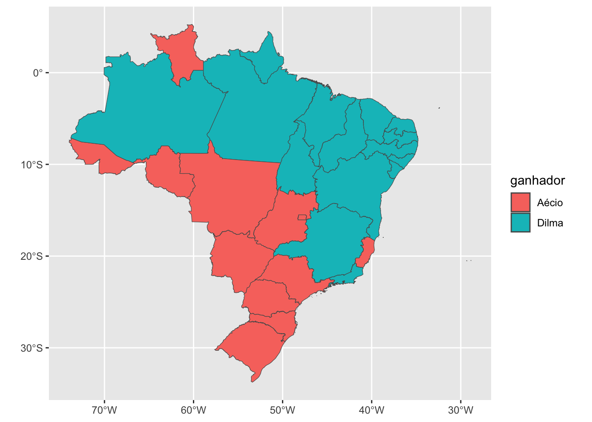

# Meu Primeiro Mapa

Texto introdutório.

## A Eleição Presidencial de 2014

Em 2014, a então presidente Dilma Rousseff (PT) enfrentou o tucano Aécio Neves no segundo turno da eleição presidencial. Para visualizar o resultado desta disputa, elaboraremos um "mapa fácil" que colore os estados brasileiros de acordo com seu candidato mais votado.

Para tal, utilizaremos apenas quatro pacotes. O primeiro deles, *dplyr*, nos ajuda a preparar a tabela com os dados eleitorais e realizar manipulações a fim de prepará-lo para nossas análises. Com função semelhante, o *sf* nos auxiliar a manipular dados espaciais--essencial para a maior parte das análise que utilizam mapas. O *ggplot2*, pacote frequentemente utilizado para visualização de dados, nos ajudará a "plotar" as informações nos mapas. Por fim, o pacote *geobr* foi desenvolvido para gerar "shape files" (arquivos com dados espaciais), os quais utilizaremos como parâmetros para nossos mapas.


```r
## Carregando os pacotes relevantes
library(dplyr) ## Gramática para manipulação de dados
library(sf) ## Gramática para dados espaciais
library(ggplot2) ## Elaboração de gráficos
library(geobr) ## Mapas brasileiros
```

Nosso próximo passo é gerar uma tabela (*tibble*) com os dados que queremos plotar no mapa. Ou seja, uma coluna para os estados brasileiros e outra indicando o candidato vencedor. É importante notar que o nome da variável "estados" (a primeira linha da coluna) precisa estar alinhada com a nomenclatura utilizada no pacote *geobr*. Por tal motivo, utilizaremos o termo *abbrev_state* (referindo-se a abreviação dos nomes dos estados).

No bloco abaixo, apresentamos uma forma simples para gerar esta tabela. No entanto, também é possível produzí-la no MS Excel (ou seu software de preferência) e importá-la para o R.


```r
ganhadores_2014 <- tibble(abbrev_state = 
                                    c("RS", "SC", "PR",
                                      "SP", "MG", "RJ", "ES",
                                      "MS", "MT", "GO", "DF", "TO",
                                      "RO", "AC", "AM", "PA", "AP", "RR",
                                      "MA", "PI", "CE", "RN", "PB", 
                                      "PE", "AL", "SE", "BA"),
                                  ganhador =
                                    c("Aécio", "Aécio", "Aécio",
                                      "Aécio", "Dilma", "Dilma", "Aécio",
                                      "Aécio", "Aécio", "Aécio","Aécio", "Dilma",
                                      "Aécio", "Aécio", "Dilma", "Dilma", "Dilma", "Aécio",
                                      "Dilma", "Dilma", "Dilma", "Dilma", "Dilma", 
                                      "Dilma", "Dilma", "Dilma", "Dilma"))
```

A tabela (*tibble*) construída será como esta que apresentamos abaixo.


```r
data.frame(ganhadores_2014)
```

```
##    abbrev_state ganhador
## 1            RS    Aécio
## 2            SC    Aécio
## 3            PR    Aécio
## 4            SP    Aécio
## 5            MG    Dilma
## 6            RJ    Dilma
## 7            ES    Aécio
## 8            MS    Aécio
## 9            MT    Aécio
## 10           GO    Aécio
## 11           DF    Aécio
## 12           TO    Dilma
## 13           RO    Aécio
## 14           AC    Aécio
## 15           AM    Dilma
## 16           PA    Dilma
## 17           AP    Dilma
## 18           RR    Aécio
## 19           MA    Dilma
## 20           PI    Dilma
## 21           CE    Dilma
## 22           RN    Dilma
## 23           PB    Dilma
## 24           PE    Dilma
## 25           AL    Dilma
## 26           SE    Dilma
## 27           BA    Dilma
```

Nosso próximo passo é baixar os dados cartográficos do pacote *geobr*. Basicamente, queremos baixar uma tabela que contenha os estados brasileiros e informações geográficas (e geométricas!) nos informando como eles devem ser "desenhados".


```r
mapa_brasil <- read_state(code_state="all",
                          year=2018,
    showProgress = FALSE)
```


```r
ganhadores_2014 <- left_join(mapa_brasil, ganhadores_2014, by = "abbrev_state")
```


```r
ganhadores_2014  %>%
  ggplot() + 
  geom_sf(aes_string(fill = "ganhador"))
```


